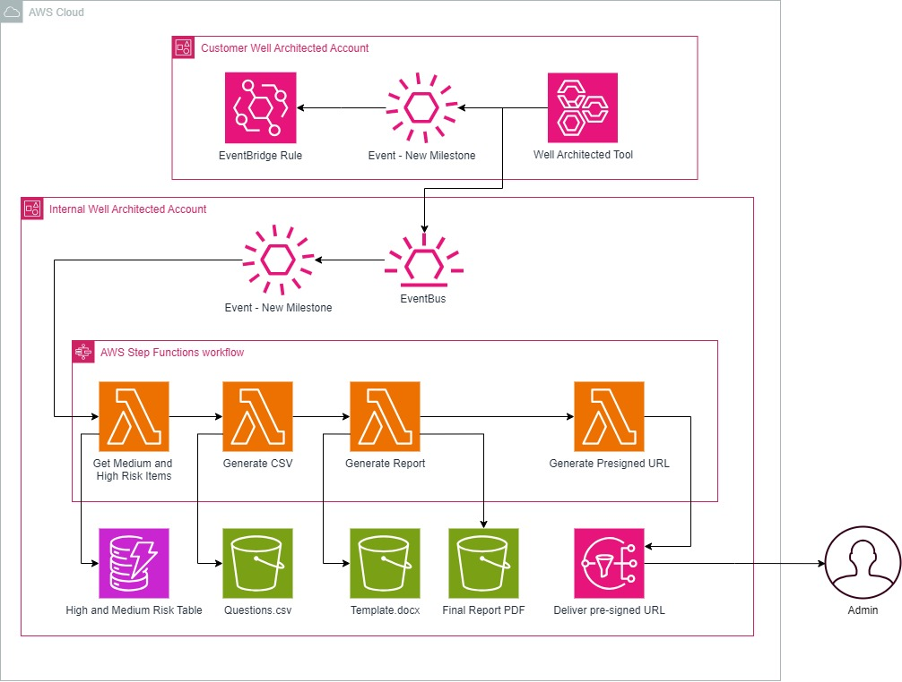

## WAFR Report Generator

# Workflow Overview

This workflow automates generating a **Well-Architected Review Report** based on milestones created in the **Well-Architected Tool**. The workflow leverages AWS services like **Step Functions**, **Lambda**, **S3**, and **EventBridge** to process the data and deliver a final report to the admin.

The infrastructure consists of two separate infrastructure deployments.

### 1. Customer CloudFormation Template:

- This consists of a CloudFormation template which should be deployed in the customer environment where the Well Architected Review is carried out in. This stack includes an EventBridge rule which is triggered when a new Milestone is created. This EventBridge rule then passes the information to the instrasturce in the Processing account.

### 2. Internal Terraform Infrastructure:

- This consists of multiple modules consisting of various services which runs a State Machine to take the Well Architected information and pass it through multiple stages, including creating a report and emailing to an administrator. 

## Workflow Steps

### 1. Template File Preparation
- **Precondition**: A template file (`Template.docx`) is manually uploaded into the **Template S3 Bucket**. This is required as the foundation for generating the final PDF report.

### 2. Milestone Trigger in the Customer Account
- **Well-Architected Tool**: A customer completes a new milestone in the **Well-Architected Tool** (e.g., they complete a review for their workload).
- **EventBridge Rule**: The new milestone triggers an **EventBridge Rule** in the customer's account.
- **Event Forwarding**: The EventBridge rule forwards the "New Milestone" event to the **Internal Well-Architected Account** using an EventBridge event bus.

### 3. Internal Well-Architected Account: Triggering the Step Functions Workflow
- **Event Bus**: The "New Milestone" event is received by the **Internal Well-Architected Account's EventBus**, triggering the **AWS Step Functions Workflow**.

### 4. AWS Step Functions Workflow Execution
The Step Functions workflow orchestrates the following steps using Lambda functions:

#### Step 4.1: Get Medium and High Risk Items
- **Lambda Function**: Retrieves details of **medium-risk** and **high-risk** items from the **Well-Architected Tool** for the relevant workload milestone.
- **Output**: Generates a table of risks that is stored as `High and Medium Risk Table` in the **S3 Bucket**.

#### Step 4.2: Generate CSV
- **Lambda Function**: Creates a CSV file with questions and their answers (e.g., workload assessment details).
- **Output**: Stores the `Questions.csv` in the **S3 Bucket**.

#### Step 4.3: Generate Report
- **Lambda Function**: Combines:
  - The retrieved **Risk Data**,
  - The **Questions CSV**, and
  - The pre-uploaded `Template.docx` from the template bucket.
- **Output**: Creates a formatted **Final Report PDF** and stores it in the **S3 Bucket**.

#### Step 4.4: Generate Presigned URL
- **Lambda Function**: Generates a **pre-signed URL** for the **Final Report PDF** stored in the **S3 Bucket**.
- **Output**: The pre-signed URL is ready for secure delivery.

#### Step 4.5: Deliver Pre-Signed URL
- **Admin Notification**: The pre-signed URL is delivered to the **Admin**, allowing them to securely download the final PDF report.

---

## Final Output

- **Admin** receives a link to the generated **Final Report PDF** via the **pre-signed URL**.
- This report contains the detailed assessment, including risks and recommendations, formatted according to the provided template.

## Architecture Diagram:

